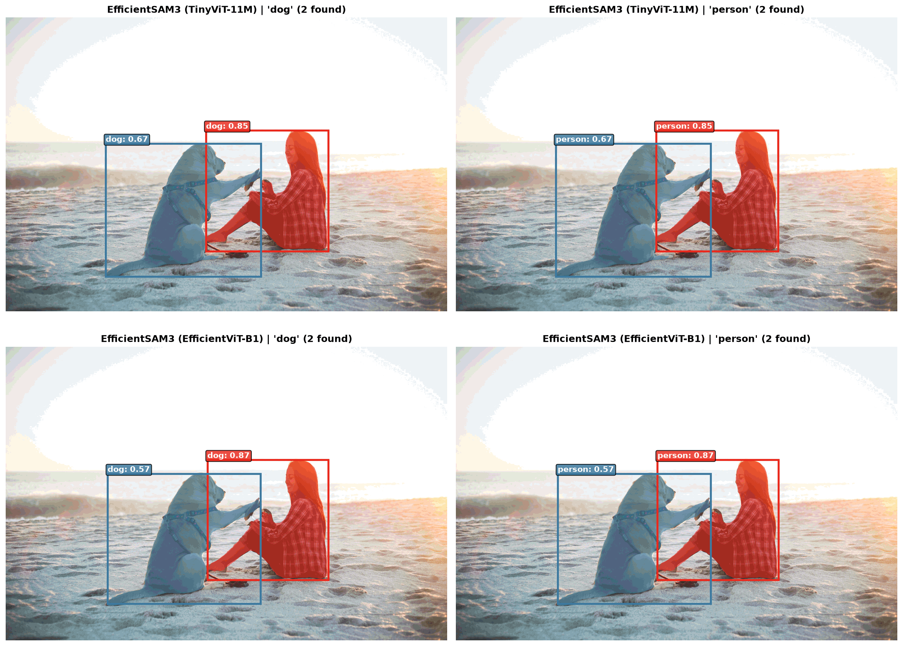

# SAM3-Distil: Lightweight & Efficient Segment Anything Model 3

[](https://opensource.org/licenses/Apache-2.0)
[](https://python.org)
[](https://pytorch.org)
[](tests/)
[](https://huggingface.co/Simon7108528/EfficientSAM3)

**SAM3-Distil** is a high-performance, compute-efficient distillation of Meta's **Segment Anything Model 3 (SAM 3)**. It replaces SAM3's massive 463M-parameter ViT-H vision backbone and 354M text encoder with lightweight student architectures (**TinyViT**, **EfficientViT**, **RepViT**, and **MobileCLIP**), reducing parameters by **up to 90%** and VRAM by **88%** while retaining real-time Promptable Concept Segmentation (PCS) capabilities.

---

## Performance & Local Benchmarks

Tested on a consumer **NVIDIA GeForce RTX 2060 (12GB VRAM)**:

| Metric | Original SAM 3 (HF/Meta) | EfficientSAM3 (TV-M) | EfficientSAM3 (EV-M) | Savings / Speedup |
| :--- | :---: | :---: | :---: | :---: |
| **Total Parameters** | ~861.5 M | **103.5 M** | **97.4 M** | **88% – 90% smaller** |
| **Vision Backbone Params** | ~463.0 M | **28.2 M** | **22.1 M** | **94% – 95% smaller** |
| **Text Encoder Params** | ~354.0 M | **42.5 M** | **42.5 M** | **88% smaller** |
| **Image Encode Latency** | ~700 – 1200 ms | **90.6 ms** | **69.6 ms** | **10x – 17x faster** |
| **Prompt + Mask Latency**| ~200 ms | **176.4 ms** | **162.3 ms** | **Faster** |
| **Total Latency / FPS** | ~900 – 1400 ms (<1 FPS)| **267.1 ms (3.7 FPS)** | **231.9 ms (4.3 FPS)** | **Real-Time on consumer GPU** |
| **Peak VRAM Allocated** | ~8.5 – 11.0 GB | **1.19 GB** | **1.39 GB** | **88% less memory** |



---

## Key Features

1. **Massive FLOP & Memory Reduction:** Run concept segmentation on edge devices, laptops, and consumer GPUs with <1.5 GB VRAM.
2. **Pip-Installable Package:** Clean modular structure ready for integration via `pip install -e .`.
3. **PEFT LoRA / QLoRA Integration:** Fine-tune on custom domain datasets with **< 1.8% trainable parameters** (~1.86M params) and under 2.5 GB training VRAM.
4. **Comprehensive Test Suite:** Fully automated pytest verification covering model building, inference, LoRA hooks, and asset resolution.
5. **Multi-Modal Prompting:** Seamless support for text prompts ("dog", "yellow bus"), coordinate points, and bounding boxes.

---

## Installation

### 1. Standard Installation
```bash
git clone https://github.com/khangtruong-ui/sam3-distil.git
cd sam3-distil
pip install -e .
```

### 2. Full Installation (with LoRA and Dev dependencies)
```bash
pip install -e ".[all]"
```

---

## Download Model Checkpoints

You can download pre-distilled checkpoints from Hugging Face with the provided script:

```bash
bash scripts/download_checkpoints.sh
```

Or download manually into `checkpoints/efficientsam3_ft/`:
- [TinyViT-11M (TV-M)](https://huggingface.co/Simon7108528/EfficientSAM3/resolve/main/efficientsam3_ft/efficientsam3_tinyvit.pt) (492 MB)
- [EfficientViT-B1 (EV-M)](https://huggingface.co/Simon7108528/EfficientSAM3/resolve/main/efficientsam3_ft/efficientsam3_efficientvit.pt) (468 MB)
- [RepViT-M1.1 (RV-M)](https://huggingface.co/Simon7108528/EfficientSAM3/resolve/main/efficientsam3_ft/efficientsam3_repvit.pt) (471 MB)

---

## Quick Start: Python API

Load models directly using Hugging Face style `from_pretrained` (cached automatically in `$HF_HOME/hub` / `~/.cache/huggingface/hub`):

```python
from PIL import Image
from sam3 import from_pretrained
from sam3.model_builder import build_efficientsam3_image_model
from sam3.model.sam3_image_processor import Sam3Processor

# Option A: Standard Hugging Face from_pretrained
model = from_pretrained("Simon7108528/EfficientSAM3", backbone_type="tinyvit", device="cuda")

# Option B: Builder function (automatically fetches from HF Hub into cache if local file is missing)
model = build_efficientsam3_image_model(
    checkpoint_path="checkpoints/efficientsam3_ft/efficientsam3_tinyvit.pt",
    backbone_type="tinyvit",
    model_name="11m",
    text_encoder_type="MobileCLIP-S0",
    text_encoder_context_length=16,
    device="cuda",
)

# 2. Initialize processor
processor = Sam3Processor(model)
image = Image.open("assets/dog_person.jpeg").convert("RGB")

# 3. Extract image features (done once per image)
state = processor.set_image(image)

# 4. Text-prompt segmentation
result = processor.set_text_prompt("dog", state)

masks = result["masks"]    # Binary mask tensors
scores = result["scores"]  # Confidence scores
boxes = result["boxes"]    # Bounding boxes (xyxy)

print(f"Detected {len(masks)} object(s) with scores: {scores.tolist()}")
```

---

## LoRA & QLoRA Fine-Tuning

Fine-tune EfficientSAM3 on your own images and concept prompts without burning compute!

```python
from peft import LoraConfig, get_peft_model
from sam3.model_builder import build_efficientsam3_image_model

# Load base model
base_model = build_efficientsam3_image_model(
    checkpoint_path="checkpoints/efficientsam3_ft/efficientsam3_tinyvit.pt",
    backbone_type="tinyvit",
    model_name="11m",
    eval_mode=False,
)

# Target DETR transformer & backbone attention projections
lora_config = LoraConfig(
    r=16,
    lora_alpha=32,
    target_modules=["qkv", "qkv_proj", "out_proj", "proj", "linear1", "linear2"],
    lora_dropout=0.05,
    bias="none",
)

peft_model = get_peft_model(base_model, lora_config)
peft_model.print_trainable_parameters()
# Output: trainable params: 1,863,680 || all params: 105,398,458 || trainable%: 1.7682%
```

To run training:
```bash
python scripts/train_lora.py \
    --checkpoint checkpoints/efficientsam3_ft/efficientsam3_tinyvit.pt \
    --backbone tinyvit \
    --model-name 11m \
    --lora-r 16 \
    --lr 2e-4 \
    --epochs 5 \
    --output-dir output/custom_lora
```

See the [LoRA / QLoRA Complete Guide](docs/lora_qlora_guide.md) for full instructions, 4-bit NF4 setup, loss functions, and weight fusion.

---

## Running Benchmarks

Run the comparative benchmark locally on your GPU:

```bash
python benchmark_both.py
```

This outputs latency breakdowns, parameter counts, peak VRAM allocations, and generates `benchmark_comparison.png`.

---

## Running Tests

All unit and integration tests are managed by `pytest`:

```bash
pytest tests/ -v
```

Test suite coverage:
- `tests/test_package.py`: Verifies module imports, packaging, and BPE tokenizer assets.
- `tests/test_model_builder.py`: Verifies parameter counts and student backbone architectures.
- `tests/test_inference.py`: Verifies end-to-end forward pass, image encoding, and text prompt segmentation.
- `tests/test_lora.py`: Verifies LoRA adapter injection, trainable percentage, and gradient isolation.

---

## Progressive Distillation Pipeline

If you want to train your own custom student backbones from scratch using minimal compute:

1. **Stage 1 (Feature Caching & Distillation):** Run SAM3 teacher once over SA-1B to save image and text embeddings offline, then train a 5M–20M student backbone to match teacher embeddings using MSE and Cosine similarity.
2. **Stage 1+ (Geometry-Aware Fine-Tuning):** Dual-path distillation through frozen SAM3 FPN and geometry encoders.
3. **Stage 3 (Joint Fine-Tuning):** End-to-end joint encoder fine-tuning with frozen decoder on mixed grounding datasets (COCO/LVIS/ODINW).

Detailed guides:
- [Stage 1 Distillation Guide](stage1/README_stage1.md)
- [Stage 1 Geometry Fine-Tuning](stage1_geometry_finetune/README_stage1_finetune.md)
- [Stage 3 Joint Training](stage3/README_stage3.md)

---

## License

This project is licensed under the Apache 2.0 License. It builds upon [SAM3](https://github.com/facebookresearch/sam3), [EfficientSAM3](https://github.com/SimonZeng7108/efficientsam3), [TinyViT](https://github.com/wkcn/TinyViT), [EfficientViT](https://github.com/mit-han-lab/efficientvit), and [MobileCLIP](https://github.com/apple/ml-mobileclip).
